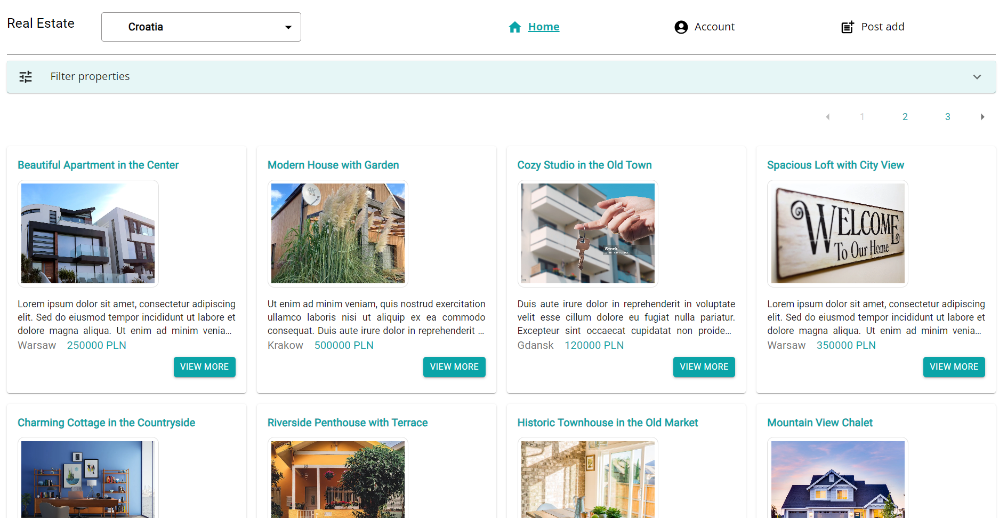
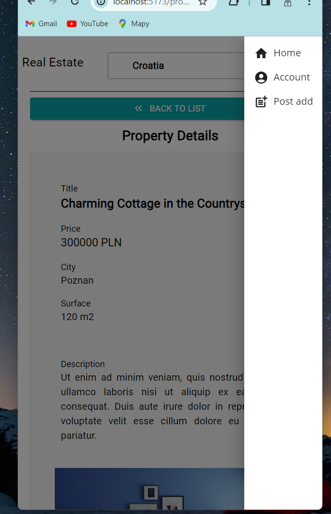
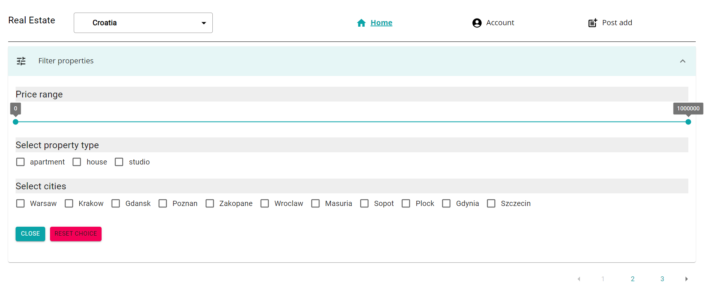
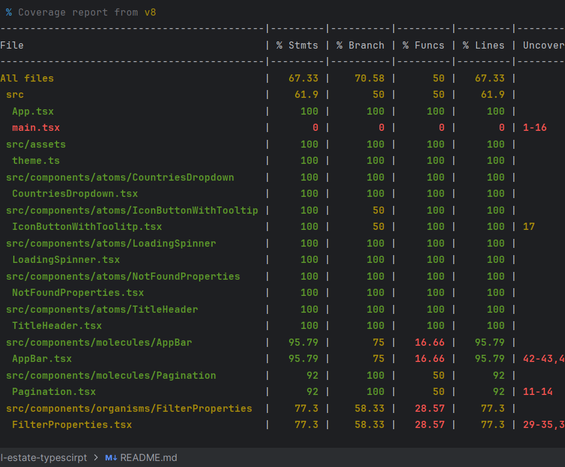
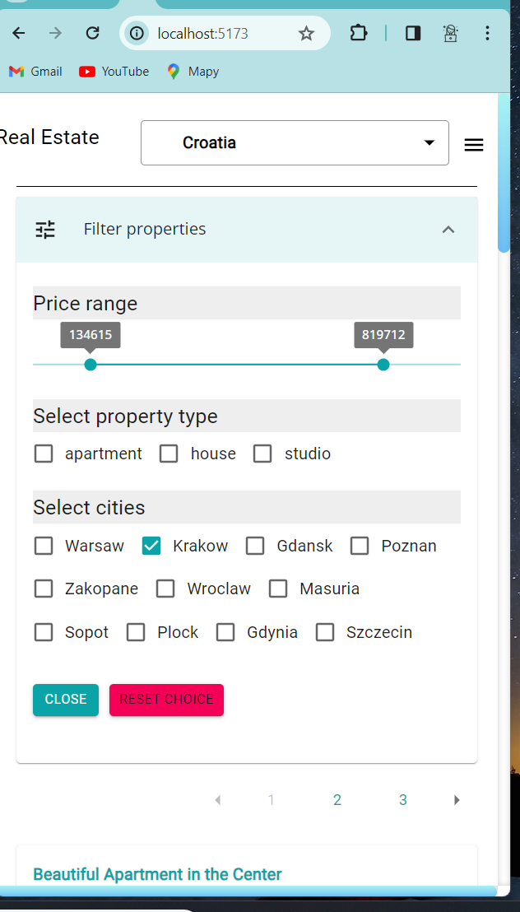
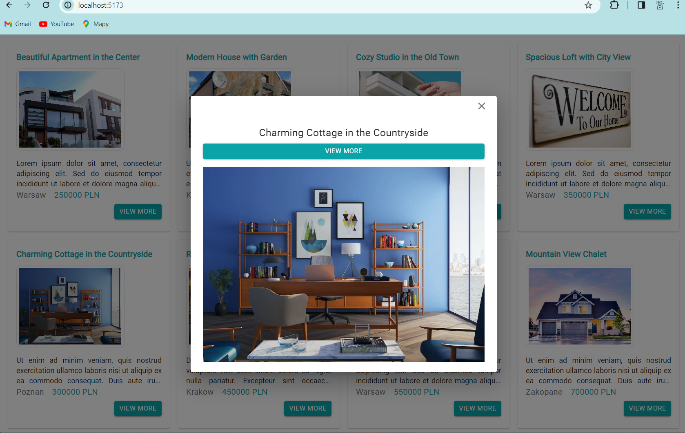

# Real estate 

Aplikacja została napisana na potrzeby zadania rekrutacyjnego na stanowisko Frontend Develope.
Służy do przeglądania ogłoszeń nieruchomości z możliwością filtrowania wyników i wyświetlania szczegółów ogłoszenia.

## Funkcjonalności

- Wyświetlanie listy ogłoszeń nieruchomości z pliku JSON.
- Prezentacja tytułu, ceny i miniatury zdjęcia dla każdego ogłoszenia.
- Możliwość wyświetlenia szczegółów ogłoszenia po kliknięciu na nie.
- Pobieranie i wyświetlanie listy krajów z zewnętrznego API.
- Filtrowanie wyników na podstawie wybranych kryteriów.
- Responsywny interfejs użytkownika dostosowany do różnych rozdzielczości ekranu.
- Nawigacja w aplikacji z wykorzystaniem React Router.
- Testy jednostkowe dla komponentów React.

## Technologie

- React.js
- Typescript
- React Router
- Axios (do wykonywania zapytań HTTP)
- Material-UI (do stylizacji komponentów)
- Vitest (do testów jednostkowych)
- Zustand - do zarządzania stanem globalnym aplikacji

## Instalacja

Aby uruchomić projekt lokalnie, wykonaj poniższe kroki:

1. Sklonuj repozytorium:

```bash
git clone https://github.com/GeniaPiano/real-estate-project
cd real-estate-project
pnpm install / yarn add / npm install
pnpm dev / yarn dev / npm run dev
```

## Screenshots









